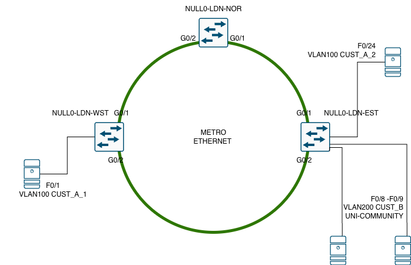

# 🧠  Metro Ethernet Rings & Cisco REP in Action | ME-3400 Series Demo
In today's deep-dive, we explore the configuration and behavior of **Cisco's Resilient Ethernet Protocol (REP)** within a **Metro Ethernet ring topology** using real **Cisco ME-3400 series switches**.

**What you'll see in this video:**
- Step-by-step **REP configuration** on a Metro Ethernet ring
- **Client connections** added to **UNI interfaces** on both the West and East switches
- A live **failure simulation** of:
  - A **switch failure to the North**
  - A **link failure between East and West switches**
- Real-time **failover demonstration** showcasing REP’s rapid convergence
- A clear breakdown of the **differences between UNI and NNI interfaces** and their roles in service provider networks

**Understanding ME-3400 Port Types:**
The Cisco ME-3400 series switches are purpose-built for **Metro Ethernet deployments**, and differ significantly from traditional Catalyst switches. They offer three distinct port types tailored for service provider environments:

| Port Type | Direction | Protocol Support | Description |
|-----------|-----------|------------------|-------------|
| **UNI** (User Network Interface) | Downstream (to customer) | ❌ No STP, CDP, PAgP, LACP | Designed for customer-facing connections with strict protocol isolation |
| **ENI** (Enhanced Network Interface) | Downstream (to customer) | ✅ Supports STP, CDP, Etherchannel | Offers flexibility for advanced customer setups |
| **NNI** (Network Node Interface) | Upstream (to core) | ✅ Supports STP, CDP, Etherchannel | Used for provider backbone connectivity and inter-switch links |

**Gear used:** Cisco ME-3400 Series switches

These distinctions are **critical** for engineers working in service provider networks, where protocol behavior and interface roles must be tightly controlled for scalability and reliability.

## 📺 Video Walkthrough

Dive into the full lab setup and explanation on YouTube:  
👉 [Watch the walkthrough]([https://youtu.be/8p9Fballx9M?si=LzpzqZAN6gIaxM6A](https://youtu.be/Tkd6QqCFm_Q)

## 🗺️ Lab Topology

Here's the visual layout of the VPC lab.  
📌 _Click to expand the image for full resolution._

